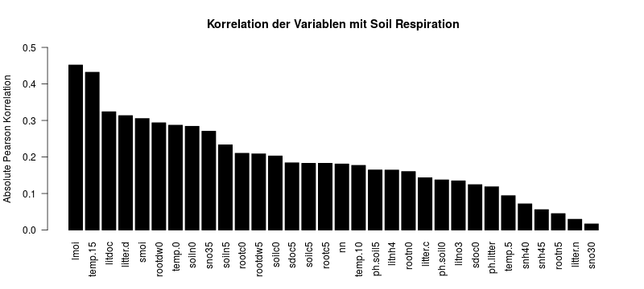

# Doc-Draft

Unsere Arbeit - in Stichpunkten und Nussschalen

## Einleitung

### Bodenatmung als geophysikalischer Prozess
- $CO_2$-Konzentration ist emminenter Bestandteil von Klimamodellen
- Bodenatmung wichtigster Prozess auf Landgebiet
- 30% der weltweiten Landfläche ist bewaldet
- Nationalpark Hainich als lokales Beispiel für Wälder in der gemäßigten Klimazone

### Der Datensatz

- 38 Messwerte, 33 Variabeln
- Viel zu wenig Messwerte, um alle Variabeln statistisch begründen zu können -> Reduktion der Featuremenge notwendig
- Viele statistische Abhänigkeiten verringern außerdem den statistischen Informaionsgehalt ($Temp_5$ bringt nur marginalen Mehrwert, wenn man $Temp_{10}$ bereits gemessen hat)

### Vorgehen

- Variabelnselektion
  - Unkorrelierte Variabeln aussortieren
  - nicht normalverteilte Variabeln aussortieren (Verteilung ist Bedingung in vielen stat. Tests)
  - Überprüfung auf Affinität (mögliche Linkfunktionen für pH,Temp und moisture)
- Erstellung des Modells
    - Wahl der 5 best korrelierten Variabeln
    - Erstellung eines linearen Modells
    - Partitionierung: 80% Training / 20% Test

### Statistische Grundlagen

- Fehler
  - SPSE
  - RSS
- Informationskriterien in der Variabelnselektion
  - AIC
  - BIC
- Korrelation
  - Notwendig für Kausalität
  - Maß für Anteil der erklärten Varianz am Modell
  - Quadrierter Korrelationskoeffizient als Bestimmtheitsmaß $R^2$ in linearen Modellen (Anteil erklärter Varianz des Modells)
  - Pearson vs. Spearman
  - Person: linear, erfordert Normalverteilung
  - Spearman: monoton, nicht zwangsweise linear
- Shapiro-Test
  - Test auf Normalverteilung
- F-Test in verschachtelten Modellen
  - Test auf signifikantem Unterschied zweier Modelle mit verschachtelten Featuremengen
  - Wird der Fehler $RSS$ wirklich so stark reduziert, dass es sich lohnt, die Freiheitsgrade des Modells zu erhöhen (mehr Features)?
  - Die R-Funktion `anova(model1,model2)` testet, ob zwei verschachtelte Modelle (Model 2 enthält alle Variabeln von Modell 1 + weitere), die auf den gleichen Trainingsdaten erstellt wurden, sich signifikant unterscheiden. Ist der p-Value (in R `F Pr(>F)` im anova-Table) kleiner $0.05%$ kann die Nullhypothese (Zusätzliche Features erklären die Varianz nicht besser als das ursprüngliche Modell) verworfen werden. Das erweiterte Modell ist somit signifikant besser.

## Erstellung eines statistischen Modells

- Daten: hainich.csv, A. Soe, MPI Biogeochemie
- Programmierumgebung: R
- Variabelnselektion `hainich-variablenselektion.r`

### Korrelation
- Relevante Features müssen mit der Bodenatmung korrelieren
- Unkorrelierte Features sind nur Rauschen und werden aussortiert
- Lineare Modelle erfordern lineare Korrelation

#### Spearman-Korelation
- monotone, nicht zwangsläufig lineare, Korrelation
- Features, die Spearman aber nicht Person korreliert sind, benötigen eine Linkfunktion (Sie sind relevant und müssen linearisiert werden)

#### Pearson-Korrelation (fig/correlation-pearson.png)

- *lmoi* und *temp.15* korrelieren sehr stark
- die besten 8 sind (*lmoi*, *temp.15*, *litdoc*, *litter.d*, *smoi*, *rootdw0*, *temp.0*, *soiln0*)
- die untere Schranke ist *soiln0* mit 0.28408188
~~~
hainich.pear <- abs(cor(hainich))["soil.res",-1]
~~~

### Linkfunktionen
- Stark Spearman korrelierte Variabeln benötigen eine Linkfunktion zur Linearisierung
- Bsp: pH ist etwas Spearman aber sehr wenig Pearson korreliert, aufgrund der log. Definition des pH-Wertes. Hier wäre Linkfunktion nötig.
- Paper von A. Soe und Regel von Arrhenius schlagen log-Linkfunktion für Temperatur vor
- Abb zeigt: Bei aktueller Datenlage kein logarithmischer Zusammenhang erkennbar
- Außerdem: $Temp15$ ist auch Pearson koreliert
- Deswegen: Keine Linkfunktion angewandt da unnötig (keine Evidenz)

### Shapiro-Filter (fig/normalverteilung-shapiro.png)

- von den 8 Varaiablen die am besten mit *soli.resp* korrelieren sind 4 normalverteilt (p-Value > 0.05)
- übrig bleiben *lmoi*, *temp.15*, *smoi*, *soiln0*
~~~
hainich.shapiro <- mapply(function(x) shapiro.test(x)$p.value,hainich)
~~~

### Sonstiges
- Stat. Abhänigkeit zw *lmoi* und *smoi* vermutet, aber keine Korrelation zwischen *lmoi* und *smoi* vorhanden (R-Wert?). Deswegen beide ins Modell genommen
- *litter.d* in Top 3 nach BIC, aber nicht normalverteilt. Deswegen nicht hinzugenommen

### Variablenselektion mit "forward selection" (fig/variablenselektion-bic-adjr2.png)

- Sampling der Daten auf test/train
- R-Paket `leaps` und Funktion `regsubsets`
- Ergebnis: `soil.res ~ 1 + lmoi + temp.15 + smoi`
- Grundlage ist BIC. Hinzufügen einer weiteren Featurevariabel führte nur zu schlechteren BIC Werten
~~~
library("leaps")
hainich.leaps <- regsubsets(soil.res ~ 1 + lmoi + temp.15 + smoi + soiln0,
                             data=hainich.train, method = "forward")
~~~

### Training des linearen Modells mit `lm(...)`

## Simulation und Fehlerabschätzung

- Beim F-Test wird die Hypothese überprüft, ob eine zusätzliche Featurevariabel den Fehler $RSS$ signifikant im Bezug auf die zusätzlichen Freiheitsgrade verbessert
- Das kann zu Fehlentscheidungen führen, da maximale $F$-Werte nicht zwangsläufig zu minimalen direkten Fehlern $SPSE$ führen
- Das kann mehrere Gründe haben:
  - F-Test fordert Normalverteilung. Das ist nicht immer gegeben
  - Gemesse Features sind nicht aussagekräftig
  - Datenerhebung fehlerhaft
  - Stat. Abhänigkeiten von Variabeln verzerren Ergebnis
  - Test kann auch nur zufällig richtig sein (p-Value?)
- Vorhergensweise
  - gegeben: Vorher erstelltes Model, welches als "wahr" angesehen werden kann
  - Partioniere Datensatz in Test und Train (Kreuzpartitionierung oder zufällig mittels Monte-Carlo)
  - Versuche ein weiteres mögliches Feature hinzuzunehmen
  - Überprüfe, ob die Entscheidung mit maximalem F-Wert auch das Modell mit geringstem Fehler $SPSE$ ist. Wenn dies nicht der Fall ist, liegt eine Fehlentscheidung vor.
  - Die Häufigkeit der Fehlentscheidung ist eine Schätzung für die Wahrscheinlcihkeit Fehlentscheidungen bei der Nullhypothese
- Auswertung
  - Schätze Wahrscheinlichkeit zur Fehlentscheidung von $H_0$
  - Überprüfung mittels Kerneldichte: Sind die F-Werte auch f-verteilt?
    - Unter der Nullhypothese (Erweitertes Modell ist nicht besser als das "wahre" Modell) ist die F-Statistik eine F-verteilte Zufallsvariabel. Die Dichtefunktion der Daten aus der Kreuzüberprüfung (approx. durch Kernel-Desity) ist nach dem Bild mitunter stark abweichend. Die Simulation möchte demnach das wahre Modell erweitern (Ho abgelehnt). Das führt zu Overfitting.
  - Waren die Entscheidungen knapp?

## Diskussion

- Wir haben zur Simulation und zur Modellerstellung dieselben Daten evrwendxet. Das ist statistisch unsauber.
- Um jeden Datenpunkt möglichst nur einmal zu verwednen, wurde Kreuzpartionierung angewandt. Monte-Carlo-Ansatz widerspricht diesem Aspekt. Er ist allerdings nötig, um die Wahrscheinlichkeit genauer abschätzen zu können. Sonst hätte man bei n-facher Kreuzpartionierung nur n Werte zur Bestimmung der Wahrscheinlichkeit

## Zusammenfassung

- Wie gut lässt sich ein Modell mit so wenig Daten bauen?
- Wie oft trifft der F-Test Fehlentscheidungen?

## Bilder

