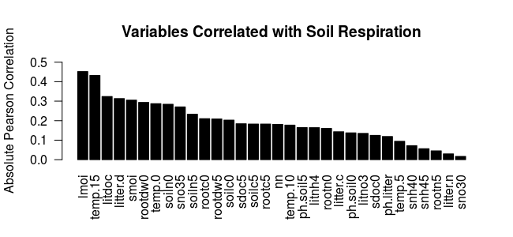
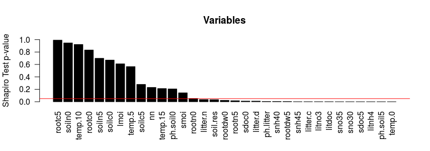
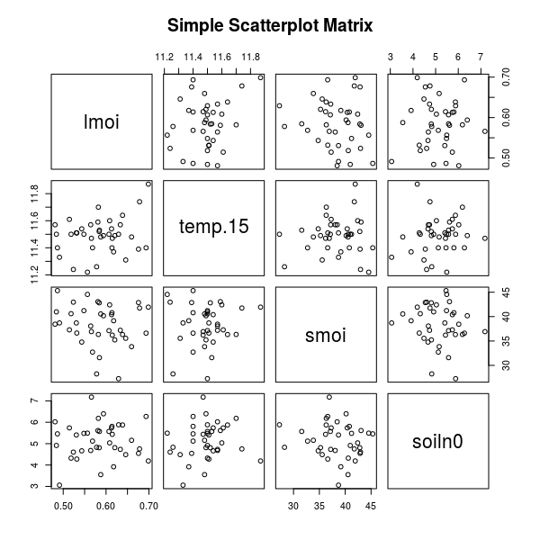

# Statistik-Projekt: Bodenatmung
Wir gehen wie folgt vor:

## Erstellung des Modells
<<<<<<< Updated upstream
- Der Datensatz enthält sehr viele Features im Vergleich zur Anzahl an Messungen. Der Suchraum der Variablenselektion wäre viel zu groß.
- **Vorauswahl.** Es werden nur stark korrelierende (Pearson) und normalverteilte (Shapiro-Wilk) Variablen in Betracht gezogen
- Shapiro-Wilk: p-Value > 0.05 dann normalverteilt
- von den Top 8 korrelierenden Variablen sind nur 4 normalverteilt

`hainich.lm3 <- lm(soil.res ~ 1 + lmoi + temp.15 + soiln0, data=hainich.train)` # top 3 by correlation 

- **Modellqualität.** Genommen wird das *kleinste* Modell, welches einen $SPSE < 0.05 * E(soil.res)$ hat. Hierbei wird das Modell auf *Trainingsdaten* ($\approx 80\%$) der Daten gelernt und auf Testdatensatz miteks $SPSE$ evaluiert. Diese Untermengen des Datensatzen bilden eine *Partition*.
- Um Overfitting entgegenzutreten: **Variablenselektion.** Mit Hilfe des R-Pakets `leaps` wird das Modell mit dem geringsten $BIC$ ausgewählt, welches das Kriterium der Modellqualiät erfüllt. Dieses Modell besitzt 4 Variablen, davon korreliert `rootc0` zu stark mit `smoi` und wird nicht mit ausgewählt.
=======

- Der Datensatz enthält sehr viele Features im Vergleich zur Anzahl an Messungen. Der Suchraum der Variablenselektion wäre viel zu groß.
- **Vorauswahl.** Es werden nur stark korrelierende (Pearson) und normalverteilte (Shapiro-Wilk-Test) Variablen in Betracht gezogen.
- **Kopplungen.** Zur Vereinfachung werden lediglich die Kopplungen zwischen den besten 8 korrelierenden Variablen, die auch normalverteilt sind, betrachtet. Dabei handelt es sich um 4 Variablen. Kopplungen sind nicht notwendig.

Gewählte Variablen:

- *lmoi* relative Feuchte der Streuschicht (litter moisture)
- *temp15* Bodentemperatur in 15 cm Tiefe
- *smoi* relative Bodenfeuchte (soil moisture)
- *soiln0* Stickstoffgehalt des Bodens in 0-5 cm Tiefe

<!---->

<!---->

<!--- Einflüsse wie z.B. die der *Temperatur* sind nicht linear.-->
<!--**Link-Funktion.** Ins lineare Modell wird z.B. die Transformierte  $log(Temp)$ genommen.-->

<!--,-->

- **Modellqualität.** Genommen wird das *kleinste* Modell, welches einen $SPSE \textless 0.05 * E(soil.res)$ hat. Hierbei wird das Modell auf *Trainingsdaten* ($\approx 80\%$) der Daten gelernt und auf Testdatensatz mittels $SPSE$ evaluiert. Diese Untermengen des Datensatzes bilden eine *Partition*.
- Um Overfitting entgegenzutreten:
**Variablenselektion.** Mit Hilfe des R-Pakets `leaps` wird das Modell mit dem geringsten $BIC$ ausgewählt, welches das Kriterium der Modellqualität erfüllt.
>>>>>>> Stashed changes

## Simulation

- Der Datensatz ist zu klein, sodass es keinen Sinn ergibt, alle Features ins Modell aufzunehmen. *Sparse linear models* sind gefragt.
<<<<<<< Updated upstream
- viele Variablen des Datensatzes sind *statistisch abhänig*. Dadurch sind die Maxima der F-Statistiken nicht mehr F-verteilt. So kann der Fehler entstehen, dass eine Variable *fälschlicherweise* doch zum Modell hinzugenommen wird, obwohl es objektive Kriteria gegenüber ($SPSE,BIC,...$) das Modell *nicht* besser macht
- **Simulation.**
  - Angenommen, Modell $$E(soil.res) = \beta_0 + smoi * \beta_1+ temp10 * \beta_2$$ sei gegeben. Dieses "wahre "Modell ist das Ergebnis des vorherigen Prozesses.
  - Nun wird im Rahmen der *forward selection* geprüft, ob es Sinn ergibt, die zusätzliche Variable $rootdw$ hinzuzunehmen.
  Derartige Verfahren verwenden die *F-Statistik* als Prüfgröße:
  - Sei Modell 1 das "wahre" Ausgangsmodell und Modell 2 das um $rootdw$ erweiteret Modell von 1. $RSS$ ist der summierte, quadratische Fehler im Bezug auf die Prädikation des Modells einer Zeile der *disjunkten* Test-Daten. Ferner sei $p_i$ die Anzahl an Features des Modells $i$. Dann ist:
=======
- Viele Variablen des Datensatzes sind *statistisch abhängig*. Dadurch sind die Maxima der F-Statistiken nicht mehr F-verteilt. So kann der Fehler entstehen, dass eine Variable *fälschlicherweise* doch zum Modell hinzugenommen wird, obwohl es gegenüber objektiven Kriterien ($SPSE,BIC,...$) das Modell *nicht* besser macht.

### Modellerweiterung

- Angenommen, Modell $$E(soil.res) = \beta_0 + smoi * \beta_1+ temp10 * \beta_2$$ sei gegeben. Dieses "wahre "Modell ist das Ergebnis des vorherigen Prozesses.
- Nun wird im Rahmen der *forward selection* geprüft, ob es Sinn ergibt, die zusätzliche Variable $rootdw$ hinzuzunehmen.

Derartige Verfahren verwenden die *F-Statistik* als Prüfgröße:

- Sei Modell 1 das "wahre" Ausgangsmodell und Modell 2 das um $rootdw$ erweiterte Modell von 1. $RSS$ ist der summierte, quadratische Fehler im Bezug auf die Vorhersage des Modells einer Zeile der *disjunkten* Test-Daten. Ferner sei $p_i$ die Anzahl an Features des Modells $i$. Dann ist:
>>>>>>> Stashed changes
  $$F=\frac{\frac{RSS_1-RSS_2}{p_2-p_1}}{\frac{RSS_2}{n-p_2}}$$
- Für jeden Test-Datensatz gibt es somit pro Schritt der Selektion und pro zusätzlicher Variable einen F-Wert. Die *Verteilung* dieser F-Statistiken für die unterschiedlichen Test-Messungen wird nun betrachtet.
- Ferner wird nicht nur der F-Wert, sondern auch der von statistischen Abhängigkeiten *unabhängige* Wert $SPSE$ betrachtet.
- Die *beste Auswahl* ist die mit der stärksten Abnahme des unabhängigen Kriteriums $SPSE$. Ausgewählt wird allerdings ausschließlich nach maximalem F-Wert. Demnach wird immer bei $argmax(F) \neq argmax(- \Delta SPSE)$ ein Fehler begangen. Der relative Anteil der Fehlentscheidungen in der Test-Simulation ergibt eine Schätzung dafür, wie häufig fälschlicherweise die Nullhypothese $H_0: \beta_i = 0$ abgelehnt wird.

